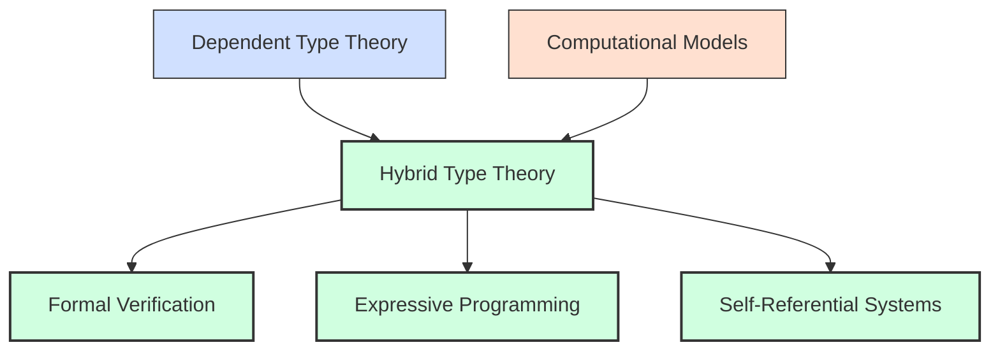
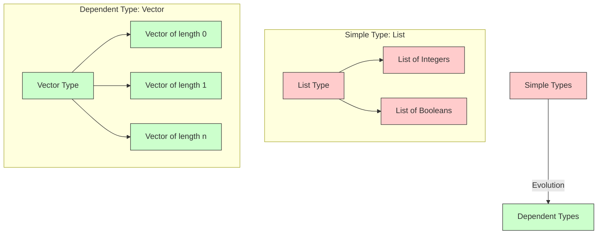
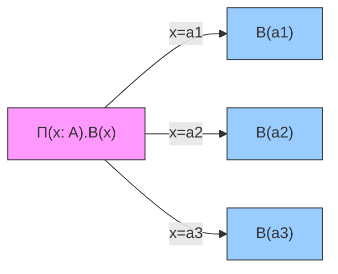
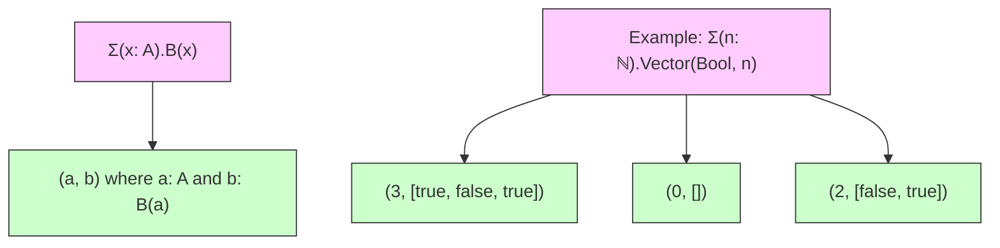
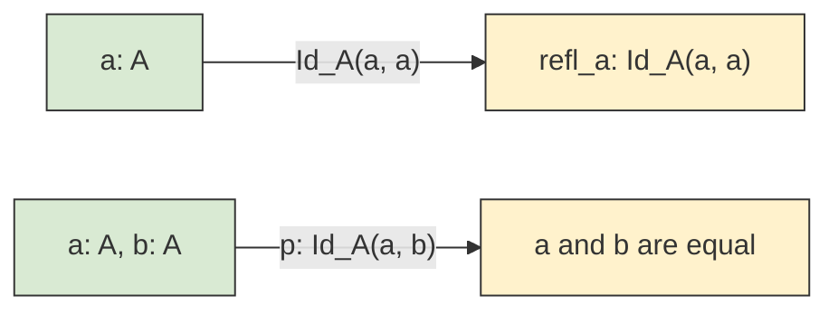
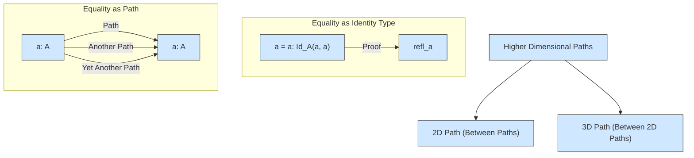
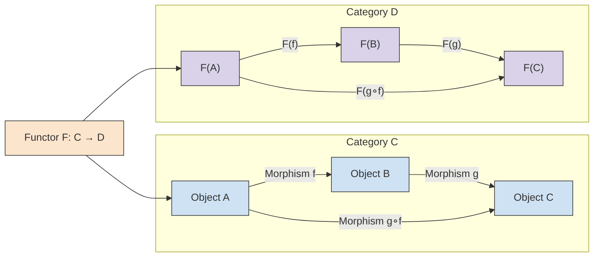

# Hybrid Type Theory: Bridging Formal Systems and Computational Models

## Introduction

This paper delves into the integration of dependent type theory with practical computational models, proposing a hybrid framework that balances formal rigor with real-world computational constraints. By uniting these paradigms, we aim to create a foundation for systems that are both theoretically sound and practically applicable.



## Formal Systems

Formal systems provide the mathematical backbone for reasoning about programs and their correctness. Martin-Löf Type Theory, for instance, offers a structured way to formalize knowledge through judgments.

| Judgment Form | Meaning | Example |
|---------------|---------|---------|
| a : A | `a` is an element of type `A` | `3 : ℕ` |
| A : Type | `A` is a well-formed type | `ℕ : Type` |
| a ≡ b : A | `a` and `b` are definitionally equal elements of type `A` | `1+1 ≡ 2 : ℕ` |
| A ≡ B : Type | `A` and `B` are definitionally equal types | `List(Bool) ≡ List(Bool) : Type` |

### The Role of Judgments

Judgments serve as the foundation for reasoning in type theory. They enable precise statements about the relationships between types and their elements, forming the basis for formal verification.

## Dependent Types

Dependent types extend the expressivity of type systems by allowing types to depend on values. This capability enables the encoding of richer invariants directly within the type system.



### Pi Types (Dependent Function Types)

Pi types (Π) represent functions where the return type depends on the input value. They are foundational for encoding parametric polymorphism and higher-order functions.



### Sigma Types (Dependent Pair Types)

Sigma types (Σ) allow the type of the second component of a pair to depend on the value of the first. They are essential for encoding dependent records and existential types.



## Identity Types

Identity types formalize the concept of equality within type theory. They enable reasoning about when two elements of a type are considered equal.



## Homotopy Type Theory (HoTT)

Homotopy Type Theory (HoTT) reinterprets identity types as paths in a topological space, providing a geometrical perspective on equality.



## Category Theory and Dependent Types

Category theory provides an abstract framework that complements type theory. Concepts such as functors and natural transformations bridge the gap between abstract mathematics and computational models.



## Advanced Topics and Future Directions

The integration of dependent types with computational models presents both opportunities and challenges. Below are some key areas for future research:

| Challenge | Potential Solution | Research Direction |
|-----------|-------------------|-------------------|
| Undecidability of type checking | Restricted dependent types | Gradual dependent typing |
| Resource constraints | Linear dependent types | Resource-aware type systems |
| Self-reference paradoxes | Stratified type universes | Homotopy Type Theory |
| Complexity management | Module systems for dependent types | Compositional verification |

## Conclusions

Hybrid type theory represents a significant step forward in bridging the gap between formal mathematical systems and practical computational models. By leveraging the expressive power of dependent types and addressing real-world constraints, this framework has the potential to revolutionize software engineering and formal verification.

```mermaid
graph TD
    A[Hybrid Type Theory] --> B[Formal Verification]
    A --> C[Expressive Programming]
    A --> D[Self-Reference]
    
    B --> E[Verified Software]
    C --> F[Advanced Type Safety]
    D --> G[Metacognitive Systems]
    
    E & F & G --> H[Next Generation AI Systems]
    
    classDef foundation fill:#d9ead3,stroke:#333;
    classDef application fill:#fff2cc,stroke:#333;
    classDef future fill:#d5a6bd,stroke:#333;
    
    class A foundation
    class B,C,D application 
    class E,F,G,H future
```
