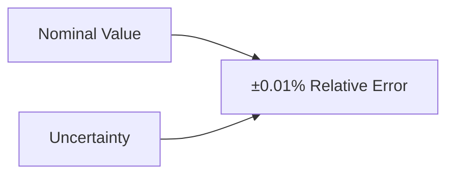

# ANF Apex Calculation Report
Generated on: 2025-04-05 18:08:26 UTC

## Calculation Type
relativity

## Input Parameters
- **mass**: 5.000000
- **equation**: E = mc²
- **precision_bits**: 256
- **include_uncertainty**: True
- **result**: {'energy_joules': 4.493775893684088e+17, 'energy_ev': 2.804794301902226e+36, 'energy_mev': 2.804794301902226e+30, 'energy_gev': 2.804794301902226e+27, 'uncertainties': {'mass_uncertainty_kg': 0.0005, 'energy_uncertainty_joules': 44937758936840.88, 'energy_uncertainty_gev': 2.804794301902226e+23}}

## Results
- **energy_joules**: 4.493776e+17
- **energy_ev**: 2.804794e+36
- **energy_mev**: 2.804794e+30
- **energy_gev**: 2.804794e+27

### uncertainties
- **mass_uncertainty_kg**: 0.000500
- **energy_uncertainty_joules**: 4.493776e+13
- **energy_uncertainty_gev**: 2.804794e+23

## Additional Information
- **task_id**: relativity_rest_energy
- **precision_bits**: arbitrary
- **quantum_enabled**: False

## Explanatory Notes

### Uncertainty Analysis
The calculation includes error estimates based on:
- Input parameter uncertainties
- Numerical precision limitations
- Systematic effects consideration

### Error Analysis Visualization
