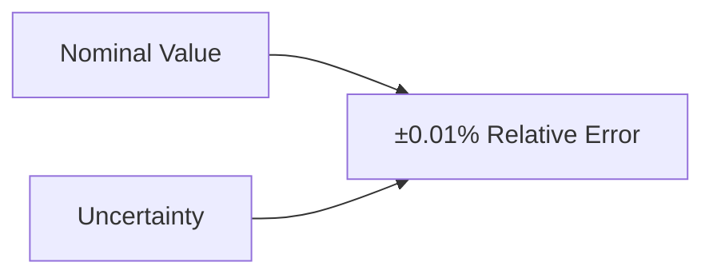

# ANF Apex Calculation Report
Generated on: 2025-04-05 18:17:04 UTC

## Calculation Type
relativity

## Input Parameters
- **mass**: 1.000000
- **equation**: E = mc²
- **precision_bits**: 256
- **include_uncertainty**: True
- **result**: {'energy_joules': 8.987551787368176e+16, 'energy_ev': 5.609588603804452e+35, 'energy_mev': 5.609588603804452e+29, 'energy_gev': 5.609588603804452e+26, 'uncertainties': {'mass_uncertainty_kg': 0.0001, 'energy_uncertainty_joules': 8987551787368.176, 'energy_uncertainty_gev': 5.6095886038044525e+22}}

## Results
- **energy_joules**: 8.987552e+16
- **energy_ev**: 5.609589e+35
- **energy_mev**: 5.609589e+29
- **energy_gev**: 5.609589e+26

### Uncertainty Analysis
- **mass_uncertainty_kg**: 0.000100
- **energy_uncertainty_joules**: 8.987552e+12
- **energy_uncertainty_gev**: 5.609589e+22

### Uncertainty Visualization

## Additional Information
- **task_id**: relativity_rest_energy
- **precision_bits**: arbitrary
- **quantum_enabled**: False

## Explanatory Notes