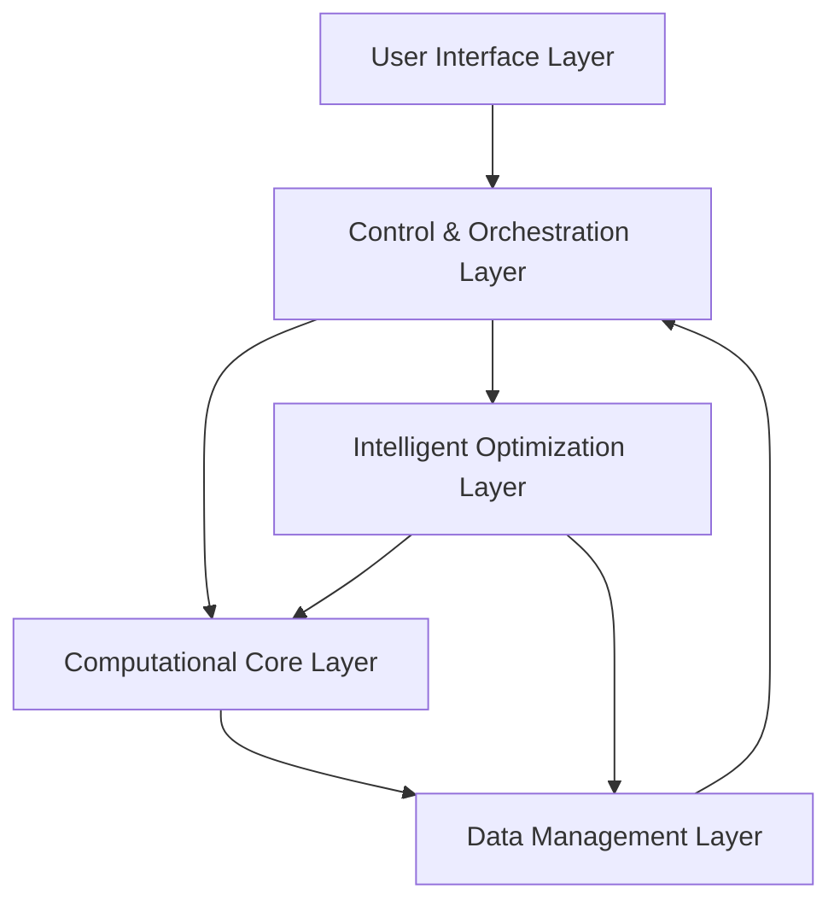
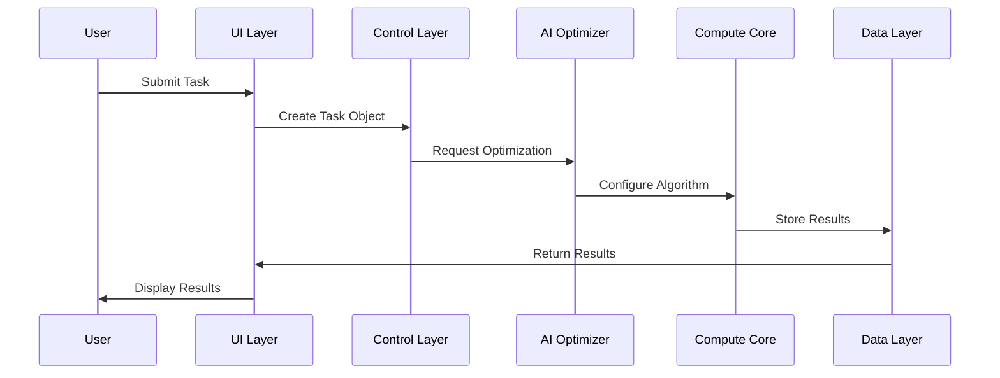
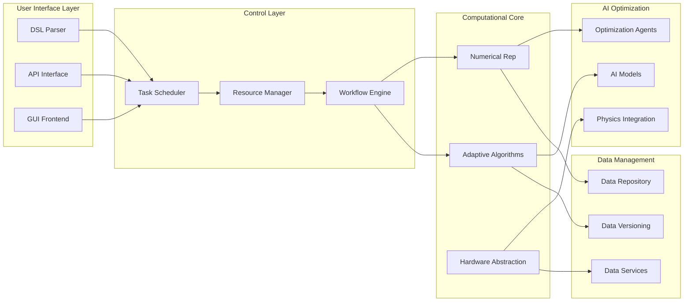
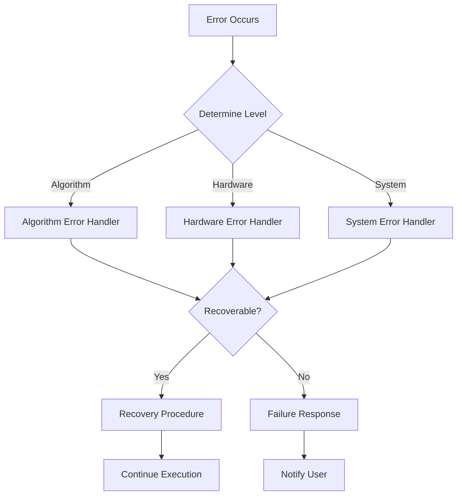
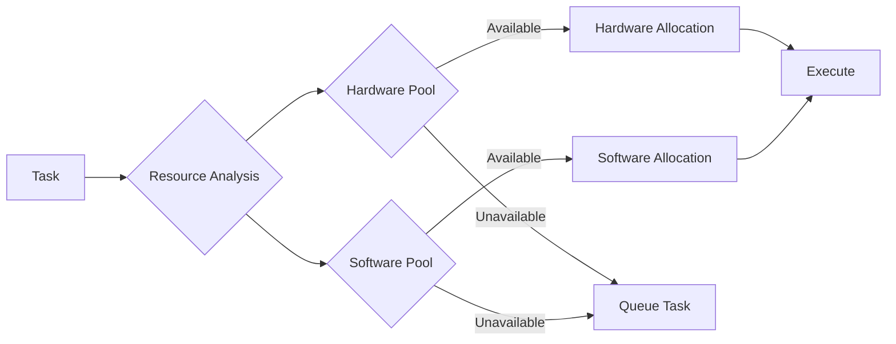
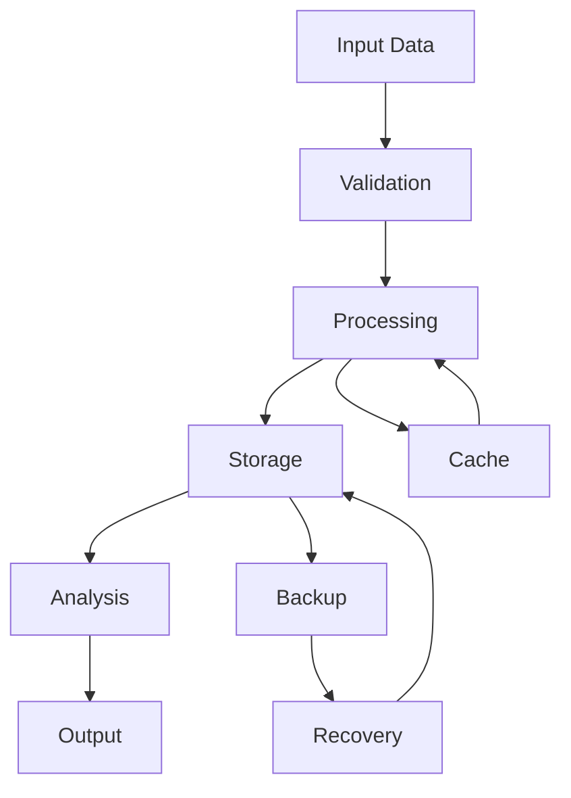

# ANF Apex System Architecture Diagrams

## System Layer Diagram

## Task Processing Flow

## Component Interaction Model

## Error Handling Flow

## Resource Allocation Workflow

## Data Flow Architecture

Note: These diagrams can be rendered using Mermaid.js or any compatible Markdown viewer that supports diagram rendering.