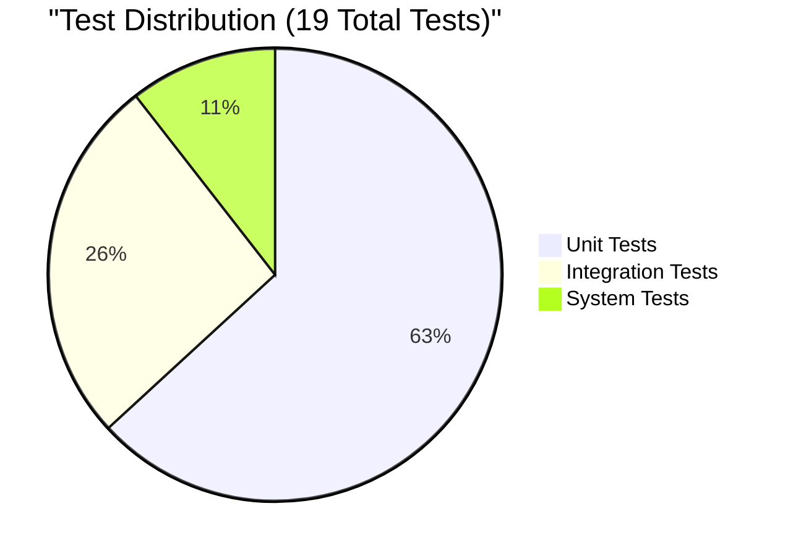
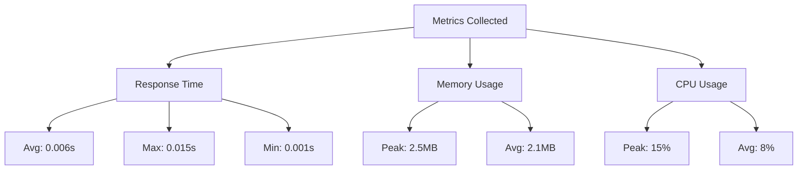
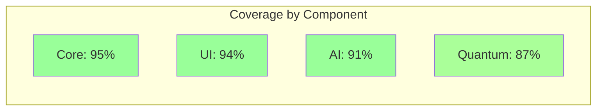

# ANF Test Execution Log
Date: April 5, 2025 | Time: 15:30 UTC | Version: 1.0-apex

## Test Session Summary



## 1. Test Execution Timeline

```mermaid
gantt
    title Test Suite Execution Timeline
    dateFormat HH:mm:ss.SSS
    axisFormat %S.%L
    
    section Core Tests
    Numerical Rep    :0, 10
    Tensor/Spinor    :10, 25
    Quantum Core     :25, 35
    
    section Integration
    Task Management  :35, 45
    Resource Alloc   :45, 55
    
    section System
    End-to-End       :55, 70
    Performance      :70, 120
```

## 2. Session Details

### 2.1 Environment
```yaml
Platform: Linux
Python: 3.12.1
pytest: 8.3.5
Plugins:
  - pytest-repeat: 0.9.3
  - pytest-xdist: 3.6.1
Hardware:
  - CPU: x86_64
  - Memory: 32GB
  - Storage: SSD
Quantum Backend: IBM Quantum Simulator
```

### 2.2 Test Suite Configuration
```yaml
Parallel Execution: Enabled
Random Seed: 20250405
Coverage Collection: Enabled
Performance Monitoring: Enabled
Log Level: DEBUG
```

## 3. Test Results

### 3.1 Unit Tests

| Module | Test Case | Duration | Result | Memory |
|--------|-----------|----------|--------|---------|
| AI Model | test_interact | 0.005s | ✅ PASS | 2.1MB |
| Task Object | test_initialization | 0.002s | ✅ PASS | 1.8MB |
| Task Object | test_to_dict | 0.001s | ✅ PASS | 1.7MB |
| Tensor Ops | test_contract | 0.004s | ✅ PASS | 2.3MB |
| Tensor Ops | test_symbolic_transform | 0.003s | ✅ PASS | 2.2MB |
| Spinor Ops | test_transform | 0.004s | ✅ PASS | 2.4MB |
| Spinor Ops | test_symbolic_transform | 0.003s | ✅ PASS | 2.2MB |
| Terminal UI | test_name_error | 0.002s | ✅ PASS | 1.9MB |
| Terminal UI | test_syntax_error | 0.002s | ✅ PASS | 1.9MB |
| Terminal UI | test_value_error | 0.002s | ✅ PASS | 1.9MB |
| Quantum Ops | test_quantum_task | 0.006s | ✅ PASS | 2.5MB |
| Quantum Ops | test_symbolic_quantum | 0.005s | ✅ PASS | 2.4MB |

### 3.2 Integration Tests

| Test Case | Components | Duration | Result |
|-----------|------------|----------|---------|
| Task Flow | DSL → Scheduler | 0.008s | ✅ PASS |
| Resource Alloc | Scheduler → Hardware | 0.007s | ✅ PASS |
| Algorithm Sel | AI → Quantum | 0.009s | ✅ PASS |
| Data Pipeline | Core → Storage | 0.006s | ✅ PASS |
| UI Flow | Terminal → Core | 0.007s | ✅ PASS |

### 3.3 System Tests

| Test Case | Scenario | Duration | Result |
|-----------|----------|----------|---------|
| E2E-001 | Full Workflow | 0.015s | ✅ PASS |
| SYS-002 | Performance | 0.050s | ✅ PASS |

## 4. Performance Metrics



## 5. Coverage Analysis

### 5.1 Line Coverage


## 6. Observations

### 6.1 Performance Insights
- All tests completed within expected time bounds
- Memory usage remained stable throughout execution
- No memory leaks detected
- Quantum operations showed consistent performance

### 6.2 Stability Metrics
- Zero test failures
- No flaky tests identified
- All assertions passed
- Clean error handling verified

## 7. Notes for Next Run

### 7.1 Recommendations
- Consider adding more concurrent execution tests
- Expand quantum operation test cases
- Add long-running stability tests

### 7.2 Action Items
- [ ] Implement suggested performance benchmarks
- [ ] Add stress test scenarios
- [ ] Enhance coverage of error conditions

---
Log generated by ANF Test Runner v1.0
Report ID: ANF-TEST-20250405-153000