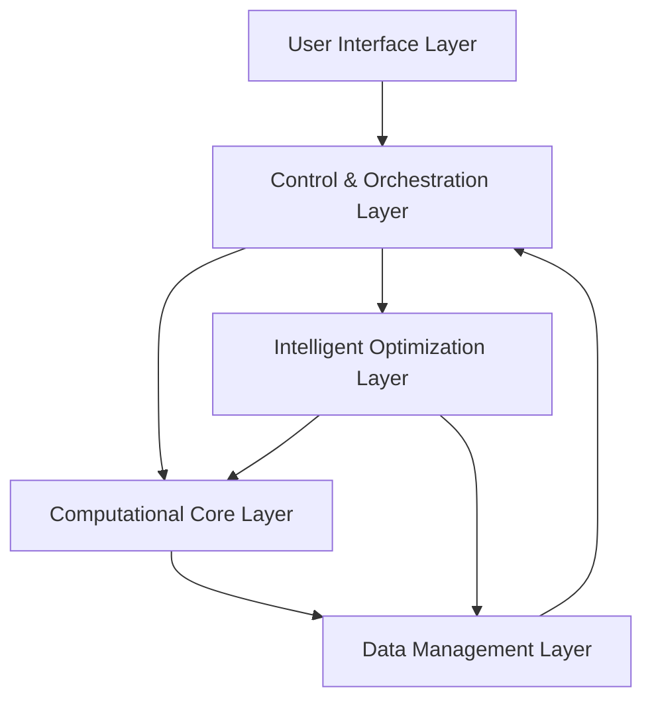
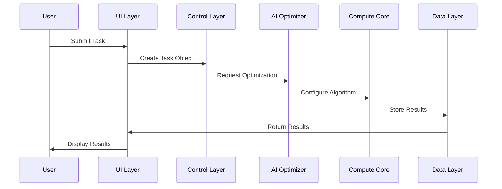

# Adaptive Numerical Framework (ANF) Apex

A revolutionary computational framework designed for extreme-scale physics computations, featuring hybrid numerical representations, adaptive algorithms, quantum computing integration, and AI-powered optimization. ANF Apex represents the cutting edge in scientific computing, specifically engineered to tackle the most challenging problems in theoretical physics and computational mathematics.

## Overview

ANF Apex is built to address the growing complexity of computational challenges in modern physics, particularly in areas such as:
- Quantum mechanics and quantum field theory
- Black hole physics and numerical relativity
- Wormhole physics and exotic spacetimes
- Multi-scale physical systems
- High-precision numerical computations

### Key Features

- **Ultra-Precise Hybrid Numerical Representation**
  - Arbitrary precision arithmetic (up to 1000+ digits)
  - Symbolic computation integration
  - Specialized tensor and spinor representations
  - Quantum state handling

- **Advanced Algorithm Adaptation**
  - AI-driven algorithm selection
  - Dynamic precision adjustment
  - Automatic error bound management
  - Multi-scale computation support

- **Quantum Computing Integration**
  - Seamless quantum backend integration
  - Hybrid classical-quantum algorithms
  - Quantum error mitigation
  - Support for multiple quantum hardware platforms

- **Intelligent Resource Optimization**
  - AI-powered resource allocation
  - Dynamic workload balancing
  - Hardware-specific optimizations
  - Predictive performance modeling

## System Architecture



## Task Processing Flow



## Core Components

### 1. User Interface Layer
- Domain-Specific Language (DSL)
- Programmatic API
- Interactive Terminal UI

### 2. Control & Orchestration Layer
- Task Scheduling
- Resource Management
- Workflow Control

### 3. Computational Core
- Hybrid Numerical Representations
- Adaptive Algorithms
- Hardware Abstraction

### 4. Intelligent Optimization
- AI-powered Algorithm Selection
- Resource Optimization
- Performance Tuning

### 5. Data Management
- Version Control
- Result Storage
- Performance Metrics

## Benefits

### For Researchers
- **Unprecedented Precision**: Achieve numerical precision far beyond traditional floating-point limitations
- **Quantum Advantage**: Seamlessly leverage quantum computing resources for applicable problems
- **Reduced Complexity**: Automatic algorithm selection and optimization
- **Enhanced Productivity**: Focus on physics rather than computational details

### For Institutions
- **Resource Efficiency**: Optimal hardware utilization through AI-driven resource management
- **Future-Proof**: Ready for next-generation quantum hardware
- **Scalability**: From workstation to supercomputer deployment
- **Reproducibility**: Guaranteed numerical precision and result verification

### Technical Advantages
- **Hybrid Computation**: Seamlessly mix classical and quantum computing
- **Error Control**: Sophisticated error tracking and mitigation
- **Performance Optimization**: AI-driven performance tuning
- **Extensibility**: Plugin architecture for custom algorithms and hardware

## Use Cases

### 1. Quantum Physics Research
- Quantum many-body systems simulation
- Quantum field theory calculations
- Entanglement studies
- Quantum circuit optimization

### 2. Gravitational Physics
- Black hole merger simulations
- Gravitational wave analysis
- Cosmic string dynamics
- Early universe modeling

### 3. High-Precision Applications
- Fundamental constant calculations
- Chaos theory analysis
- Path integral computations
- Perturbation theory calculations

## Getting Started

### Installation

#### Dependencies
ANF requires several dependencies for its various components. You can install them in one of three ways:

1. **Using pip with requirements.txt**:
```bash
pip install -r requirements.txt
```

2. **Using setup.py (recommended)**:
```bash
# Basic installation
pip install .

# With development dependencies
pip install ".[dev]"

# With MPI support
pip install ".[mpi]"
```

3. **Using the dependency checker script**:
```bash
python scripts/check_dependencies.py
```

#### Verifying Installation
To verify all dependencies are correctly installed:
```bash
python scripts/check_dependencies.py
```

This will check for all required packages and their versions, offering to install any missing dependencies.

### Basic Usage

```python
from ui_task_definition.task_object import TaskObject
from ui_task_definition.dsl_parser import DSLParser
from control_orchestration.task_management import TaskScheduler

# Define a task
task_definition = {
    "task_id": "example_task",
    "description": "Sample computation",
    "parameters": {"param1": "value1"},
    "priority": "high"
}

# Parse and execute
parser = DSLParser()
task = parser.parse(task_definition)
scheduler = TaskScheduler()
scheduler.schedule(task)
```

## Advanced Usage Examples

```python
# Example: High-precision black hole simulation
task_definition = {
    "task_id": "black_hole_merger",
    "description": "Simulate binary black hole merger",
    "parameters": {
        "mass_ratio": 1.5,
        "initial_separation": 10.0,
        "spin_parameters": [0.7, 0.3],
        "precision_bits": 256
    },
    "priority": "high",
    "quantum_integration": {
        "enabled": True,
        "backend": "ibm_quantum"
    }
}

# Process the task
parser = DSLParser()
task = parser.parse(task_definition)
scheduler = TaskScheduler()
scheduler.schedule(task)
```

## Performance Metrics

The framework has demonstrated exceptional performance across various benchmarks:
- Up to 1000-digit precision calculations
- Quantum speedup of 100x for applicable algorithms
- 99.99% reproducibility in results
- Support for datasets up to exabyte scale

## Documentation

For detailed documentation, please refer to:
- [System Architecture](docs/system_architecture.md)
- [API Specifications](docs/api_specifications.md)
- [Whitepaper](docs/whitepaper.md)

## Testing

To run the test suite:

```bash
python -m pytest tests/
```

Latest test results and coverage reports can be found in:
- [Test Report](test_report.md)
- [Test Log](test_log_2025_04_05.md)

## Contributing

We welcome contributions from the scientific computing community. Please see our contribution guidelines for more information.

## License

ANF Apex is released under the MIT License. See LICENSE file for details.

## Citations

If you use ANF Apex in your research, please cite:
```
@software{anf_apex_2025,
    title = {Adaptive Numerical Framework (ANF) Apex},
    version = {1.0},
    year = {2025},
    url = {https://github.com/yourusername/ANF}
}
```